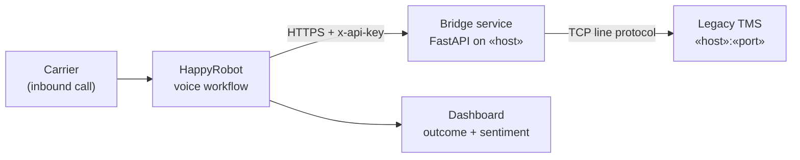

# Inbound Carrier Sales Agent — Build Description

Prepared for HappyRobot IT and business review 08-01-2026 · Maxi Schvindt · Version 1.0

---

## 1. Executive summary

Carriers calling in about available loads currently reach a human or reach
voicemail. This build answers those calls with a voice agent that verifies the
carrier, searches live TMS inventory, pitches matching loads, negotiates the rate
inside pre-set bounds, and books the load back into the TMS — transferring to a
rep whenever the conversation leaves those bounds.

The technical obstacle was the TMS itself: it exposes a raw TCP line protocol
rather than an HTTP API, so no SaaS platform can call it directly. This build
includes a purpose-made bridge service that translates HTTP to that protocol,
which is the piece IT will want to review most closely.

---

## 2. Scope

**In scope**

| | |
|---|---|
| Channel | Inbound voice, «phone number» |
| Carrier verification | «FMCSA lookup / MC number check — describe» |
| Load search | Origin, destination, equipment type — live against TMS |
| Pitch and negotiation | Up to «N» rounds, floor and ceiling set per load |
| Booking | Written back to TMS on agreement |
| Handoff | Warm transfer to «queue/number» with context |
| Reporting | Per-call outcome classification and sentiment, on a dashboard |

**Out of scope for this build:** outbound calling, carrier onboarding and
packet collection, appointment scheduling, accessorial negotiation, document
capture, payment or factoring questions.

---

## 3. Call flow

1. **Answer and identify.** Agent greets, collects MC number.
2. **Verify.** «Verification step and what happens on failure.»
3. **Qualify.** Origin, destination, equipment type, availability window.
4. **Search.** `POST /loads/search` against live TMS inventory. At least one of
   origin / destination / equipment must be present — the TMS rejects an
   unfiltered query, so the agent will not proceed on "what do you have?" alone.
5. **Pitch.** Agent presents matching loads; on interest, `POST /loads/get`
   retrieves full detail for the specific load.
6. **Negotiate.** «N» rounds within the configured rate band. Outside the band,
   or on any carrier request the agent can't satisfy, go to step 8.
7. **Book.** On agreement, `POST /loads/book` with load ID, MC number, and agreed
   rate. Confirmation read back to the carrier.
8. **Transfer or close.** Warm transfer to a rep, or a clean close if the carrier
   declines.
9. **Post-call.** Outcome classification and sentiment recorded; call surfaced on
   the dashboard.

---

## 4. Architecture

Three components:

**HappyRobot workflow** — call handling, speech, conversation logic, negotiation
guardrails, transfer, and post-call classification. Configured on the platform,
not in this repository. Link: https://platform.happyrobot.ai/fdeerwinmaximilianoschvindtg4uf/workflows/zx82rxch5182/editor/kv7mcdc8eqko.

**Bridge service** — a small FastAPI application, ~150 lines across two modules.
Stateless. Its only job is to accept authenticated HTTPS requests from the
workflow and speak the TMS protocol on the other side. Deployed on Railway with a
healthcheck at `/health`.

**Legacy TMS** — unchanged. The bridge is additive; nothing on the TMS side was
modified for this build.

---

## 5. TMS integration

### 5.1 The protocol

The TMS speaks a line-oriented ASCII protocol over TCP:

- One request per connection — connect, send, read, server closes.
- Requests are pipe-delimited `KEY:VALUE` pairs, CRLF-terminated, 4096 bytes max.
- `CMD` first, `AUTH` second, then command-specific fields.
- Success: zero or more record lines, then a line reading `END`.
- Failure: a single line, `ERR|CODE:<code>|MSG:<message>`.
- Fixed-width fields arrive right-padded with spaces.

Commands used: `LOAD_QUERY`, `LOAD_GET`, `LOAD_BOOK`. (`DEBUG_ECHO` is used only
by the local smoke test, never in the request path.)

### 5.2 Handling decisions worth flagging to IT

**Case sensitivity.** The TMS matches `LOAD_ID` and `EQTYPE` case-sensitively but
city names case-insensitively. The bridge uppercases both before sending. Without
this, a carrier saying "flatbed" produces zero results against inventory stored as
`FLATBED`.

**Equipment naming.** `EQTYPE` is stored underscored — `DRY_VAN`, not `DRY VAN` —
so the bridge also converts whitespace to underscores on that field. Because the
value originates from speech transcription, runs of whitespace are collapsed and
the value is trimmed, so `"dry  van "` and `"Dry Van"` both reach the TMS as
`DRY_VAN`. This normalization is deliberately scoped to `EQTYPE`; load IDs are
uppercased but not underscored.

**Delimiter injection.** Any value containing a `|` is rejected before the request
is built, rather than being sent and corrupting the frame.

**Frame size.** Requests over 4096 bytes are rejected client-side with a clear
error instead of being truncated on the wire.

**Response validation.** A response missing its `END` terminator is treated as
malformed and raises, rather than being returned as a partial result set. A
connection that closes with no data raises `EMPTY_RESPONSE`.

### 5.3 Retries

Failed calls retry up to 3 times with exponential backoff (0.5s, 1s, 2s), but
only for faults that time can fix: socket timeouts, connection errors, and TMS
`SERVER_ERROR`. Deterministic failures — `AUTH_FAILED`, unknown load — raise
immediately rather than burning six seconds of a live call on a result that will
not change.

Socket timeout is 30 seconds.

> **Open item for review.** `LOAD_BOOK` currently retries under the same policy as
> the read commands. If the TMS commits a booking and then fails before replying,
> a retry could book twice. Either the TMS treats repeat `LOAD_BOOK` for the same
> load ID as idempotent — which we should confirm with your team — or the bridge
> should stop retrying writes. This is listed in §9 and is the one item I'd want
> resolved before any real booking traffic.

---

## 6. Bridge API

Base URL: `https://web-production-0b749.up.railway.app`. All endpoints require an `x-api-key` request header.

| Method | Path | Purpose |
|---|---|---|
| `GET` | `/health` | Liveness probe. Unauthenticated, returns `{"status":"ok"}`. Does not contact the TMS. |
| `POST` | `/loads/search` | Search inventory by `origin`, `destination`, `equipment`. At least one required. Returns `{"loads":[...],"count":n}`. |
| `POST` | `/loads/get` | Full detail for one `load_id`. |
| `POST` | `/loads/book` | Book `load_id` for `mc_num` at `agreed_rate`. |

### Error handling

| Condition | Response |
|---|---|
| Missing or wrong API key | `401` |
| No usable filter in the request body | `400` with a message naming the required fields |
| TMS returned an error | `502`, carrying the TMS's own `code` and `message` |
| TMS returned no records for a get or book | `404` |

TMS error codes are passed through rather than flattened into a generic failure,
so the workflow can distinguish "load already covered" from "TMS is down" and say
something different to the carrier in each case.

---

## 7. Security

**Authentication.** Every TMS-touching endpoint requires a shared secret in the
`x-api-key` header. `/health` is deliberately open so the platform healthcheck
doesn't need credentials; it returns a static value and reaches nothing.

**Transport.** HTTPS from the workflow to the bridge, terminated by the host
platform. The bridge-to-TMS leg is plain TCP — the protocol offers no TLS.
«Describe the network path: public endpoint, IP allowlist, VPN, or tunnel.»
Reviewers should treat this leg as the main network question in this build.

**Credentials.** The TMS auth token and bridge API key are supplied as environment
variables and are not in the repository. `.env` is gitignored; `.env.example`
carries placeholder values only. The service refuses to start if any required
variable is missing, with an explicit message — a deliberate choice, since the
alternative failure mode looks like an unexplained healthcheck timeout.

**Data.** The bridge is stateless and writes no database, no logs of request
bodies, and no cache. Load and carrier data exists only for the life of a single
request. Call recordings, transcripts, and derived classifications are retained on
the HappyRobot platform under «retention policy».

**Exposure surface.** Four endpoints, three of them authenticated. The bridge
cannot issue arbitrary TMS commands — the three commands are hardcoded, and
field names are mapped through explicit allowlists, so a request cannot
introduce a TMS field the bridge doesn't know about.

**Repository.** Private. Reviewers invited individually.

### Known gaps

These are real and listed rather than glossed:

- No rate limiting. A leaked API key could be used to enumerate inventory.
- The API key is compared with a plain string comparison, not a constant-time
  one. Low practical risk over a network, but trivial to fix.
- No request logging or audit trail on the bridge. Fine for a demo, insufficient
  for production booking traffic.
- The booking endpoint's field validation is looser than its error message
  implies — a request with only `load_id` passes the bridge's own check and is
  forwarded to the TMS, which rejects it. The carrier-facing result is correct
  but the error path is noisier than it should be.

---

## 8. Production readiness

What this build is not, and what would change:

| Area | Demo today | For production |
|---|---|---|
| Booking retries | Writes retry like reads | Confirm TMS idempotency or disable retry on `LOAD_BOOK` |
| Hosting | «Railway, our account» | Your environment or a dedicated account under your control |
| TMS network path | «Current path» | Private connectivity; IP allowlist at minimum |
| Auth | Single shared API key | Rotated secrets, per-caller keys, key management |
| Rate limiting | None | Per-key limits |
| Observability | Platform logs only | Structured request logging, TMS latency and error-rate alerting |
| Data volume | «N» sample loads | Full inventory; re-test search behavior at real result-set sizes |
| Failover | Single instance | Redundancy, and a defined behavior when the TMS is down mid-call |

